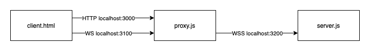

# Node TLS Proxy

A forward TLS termination proxy for NodeJS

## API

The proxy starts 2 servers: Control Server (port 3000) and Proxy Server (port 3100)

The control server is responsible for configuring TLS and has a JSON-based HTTP API:

### `POST /proxy-config`
Sets TLS config for proxy target. Returns HTTP 200 on success and 400 on error.

- Param: object
    - `host` string (proxy target host)
    - `port` number (proxy target port)
    - `ca` string (optional, PEM CA cert for verifying target server)
    - `cert` string (optional, PEM client cert for authentication)
    - `key` string (optional, PEM client key for authentication)

### `GET /proxy-test`
Tests the TLS connection by connecting to the target server.
Returns 200 if connection is successful (TLS handshake success) or 500 on error.

## Demo Setup



```
$ git clone <this repo>
$ yarn  ## Install dependencies
```

Start simple websocket echo server that requires client certificate auth on port 3200:
```
$ node server.js
```

Start proxy:
```
$ node proxy.js
```

Open the demo client in a web-browser (`client.html`).

There's a set of test certificates in the `pki` folder.
